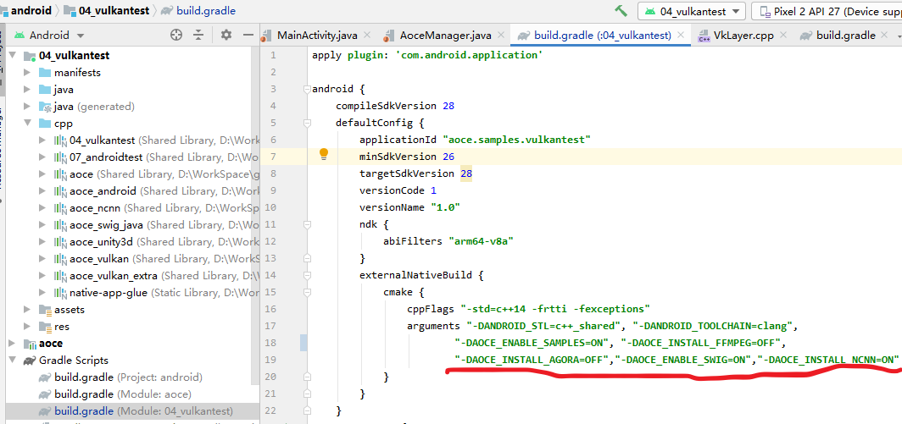
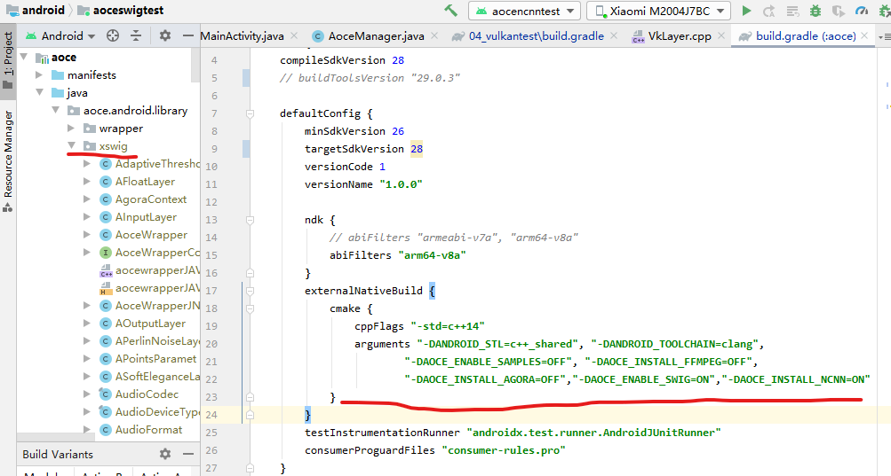

# Android

## 配置

先需要使用swig把C++接口转换生成的java代码,成功后会存放在android/aoce/src/main/java/aoce/android/library这个文件夹xswig.

要使用swig生成相应java代码,首先请在这个目录android/aoce/src/main/java/aoce/android/library下,新建一个xswig文件夹,并按照如下步骤操作.

1 安装[swig](http://www.swig.org/download.html),把带swig.exe的目录添加到环境变量Path中.

2 按照如下图settings.gradle的设置,只启用04_vulkantest,因为这个项目相对独立,只使用C++.

注意修改这个文件后,请点击Sync Now等待完成后继续操作.

3 设置编译项以及使用swig转换生成的C++接口java文件.

注意先转到对应的04_vulkantest下的build.gradle文件,请设置对应的cmake/arguments,在这,假设要使用aoce_ncnn模块,注意要把-DAOCE_INSTALL_NCNN=ON编译设置加上,这个设置会影响swig生成的文件,改变后需要重新生成.

连接真机,运行与调试都行,过程中编译C++成功后,就会在如下目录生成我们所需要的转换文件.

一般来说,这个目录会在(project/.cxx/cmake/{build type}/{abi}/swig/Java/swig)下,根据我的配置,就在(04_vulkantest/.cxx/cmake/debug/arm64-v8a/swig/Java/swig)下.

复制这个目录所有文件到android/aoce/src/main/java/aoce/android/library/xswig下,本来在CMake有定义相关逻辑自动复制过去,但是逻辑现在不完善,有时可以有时不行,最好手动操作一下吧.

4 转到java项目上来,还是针对settings.gradle设置.

其中最好把aoce里的build.gradle文件中的cmake/arguments设置与04_vulkantest相同.

等待Sync Now完成后,应该就是如上图显示,有了swig的生成文件,项目相应引用就不会有问题了.

## demo

04_vulkantest一个简单的vulkan API测试程序,其窗口使用了native窗口.

aoce包含了swig转换的C++到java接口以及一些针对JNI操作和一些公共方法.

aoceswigtest就是GPUIMage里一百多种滤镜演示demo.

aocencnntest 是联合深度神经网络推理框架ncnn的一些demo测试.

## 注意

如果你改变aoce下的build.gradle里的externalNativeBuild/cmake/arguments里选项,如有些选项AOCE_INSTALL_NCNN会改变swig产生的文件,改变后请按照如上步骤重新生成swig转换的java文件.比如你要看aoceswigtest里的滤镜,就不用包含ncnn相关的so文件(vulkan版本有点大),就把AOCE_INSTALL_NCNN=OFF,让如上设置重新生成,如果你不介意大小,可以使用相同生成的swig,但是需要注意,需要在aoceswigtest当前build.gradle里复制ncnn相关so文件,类似aocencnntest中的build.gradle中的任务copyNcnn,并且需要调用System.loadLibrary("ncnn");确保不会因为没正确加载so文件而crash.

如果你要运行04_vulkantest/05_livetest/06_mediaplayer/07_androidtest/vulkanextratest这几个项目,你需要AOCE_ENABLE_SAMPLES设置为ON,这个选项不会改变SWIG生成的文件.
