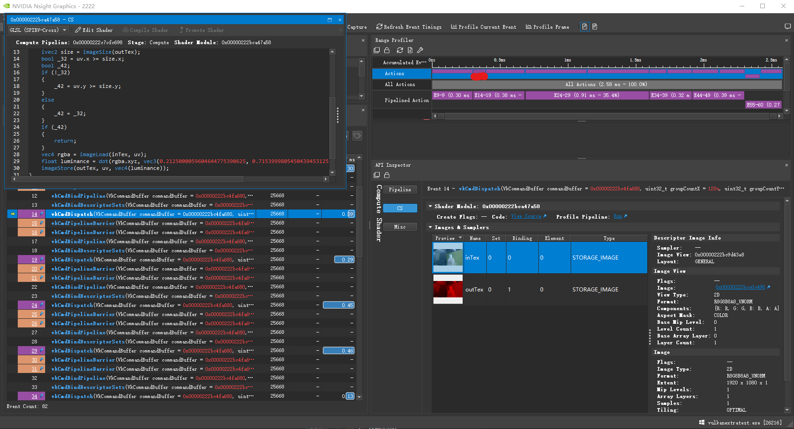
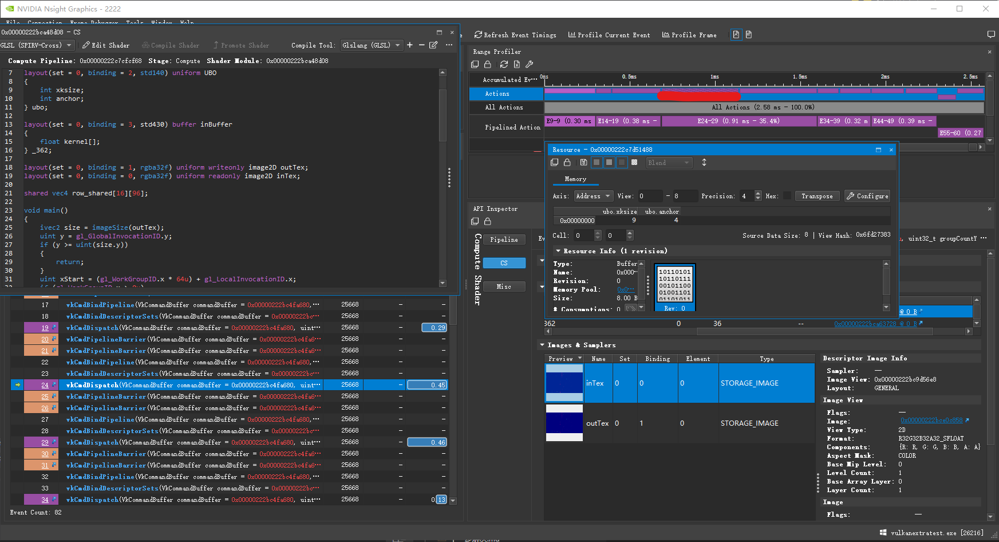
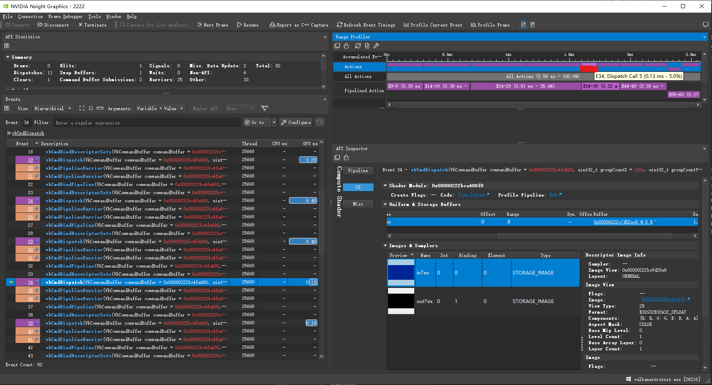
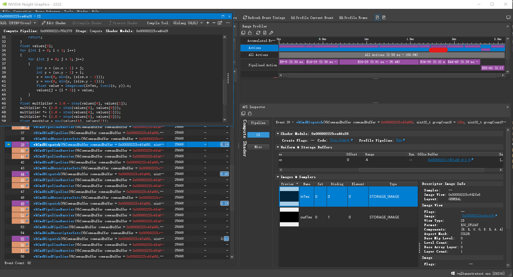

# GPU时间消耗

如无特殊说明,下面所有时间在N卡2070下,1080P的图像.

如下用Harris角点检测的流程中的一些执行层分析时间消耗.

1 简单的取亮度,0.09ms,一般的图像处理,不取周边的点.

[glsl代码](../glsl/source/luminance.comp)

2 计算XYDerivative,3*3,0.29ms.

[glsl代码](../glsl/source/prewitt.comp)

时间主要是取周边九个点上,不同于CPU,从显存取值是个大消费.

3 针对XYDerivative高斯模糊,核长9,时间0.45ms*2.

[glsl代码](../glsl/source/filterRow.comp)

同上,取周边9*9=81个点,其中高斯模糊使用卷积核分离优化,列和长分别占用0.45ms左右.

我用21核长,时间为0.79ms*2.

我用5核长,时间为0.34ms*2.

4 计算角点,0.13ms,同一类似,计算复杂度比一多点.

[glsl代码](../glsl/source/harrisCornerDetection.comp)

5 NonMaximumSuppression非极大值抑制,3*3,0.19ms

[glsl代码](../glsl/source/thresholdedNMS.comp)

相对于XYDerivative来说,同样3*3,只使用0.19ms,后面具体分析下原因.

6 角点结果box模糊,核长5,时间0.20ms*2.

[glsl代码](../glsl/source/filterRow.comp)

同上,取周边5*5=25个点,其中高斯模糊使用卷积核分离优化,列和长分别占用0.20ms左右.

其中,普通3*3,也就是NonMaximumSuppression非极大值抑制,也只需要0.19ms左右.

高斯模糊使用卷积核分离优化,时间复杂度应该是核长k,统计如上所有高斯模糊时间.
|核长|时间|类型|
|---|---|---|
|5|0.4ms|r8|
|21|1.2ms|r8|
|21|1.21ms|rgba8|
|5|0.68ms|rgbaf32|
|9|0.9ms|rgbaf32|
|11|1.0ms|rgbaf32|
|21|1.6ms|rgbaf32|
可以看到,主要和类型与核长有关,从基准5开始,大约每加一核长,增加0.05ms时间.r8/rgba8可以看到几乎没有差别,而使用rgba32f,基准时间增加0.3ms左右.
