# PC的Vulkan运算层时间计算记录

如无特殊说明,下面所有时间在N卡2070下,1080P的图像.

列举一些基本层所花费时间.

一般来说.普通计算的层大约在0.1-0.2ms之间,其中3*3的周边计算图一般在0.2-0.3ms,多核k的话,可以卷积分离的大约是(0.3 + kx0.05)ms左右,如果类型是rgba32f这种,在原来基础之上再加0.2ms左右.

如下用Harris角点检测的流程中的一些执行层分析时间消耗.

1 简单的取亮度,0.09ms,一般的图像处理,不取周边的点.

[glsl代码](../../glsl/source/luminance.comp)

2 计算XYDerivative,3*3,0.29ms.

[glsl代码](../../glsl/source/prewittEdge.comp)

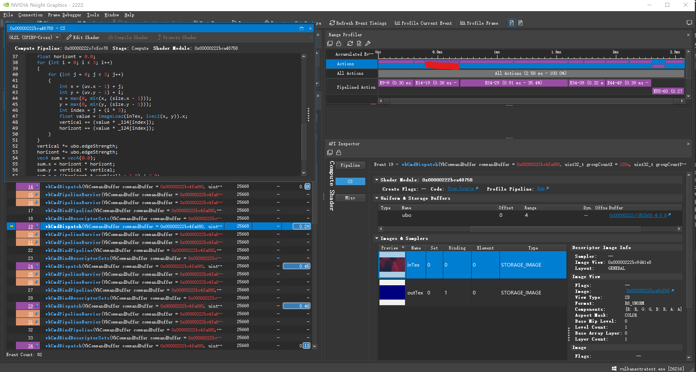

时间主要是取周边九个点上,不同于CPU,从显存取值是个大消费.

3 针对XYDerivative高斯模糊,核长9,时间0.45ms*2.

[glsl代码](../../glsl/source/filterRow.comp)

同上,取周边9*9=81个点,其中高斯模糊使用卷积核分离优化,列和长分别占用0.45ms左右.

我用21核长,时间为0.79ms*2.

我用5核长,时间为0.34ms*2.

4 计算角点,0.13ms,同一类似,计算复杂度比一多点.

[glsl代码](../../glsl/source/harrisCornerDetection.comp)

5 NonMaximumSuppression非极大值抑制,3*3,0.19ms

[glsl代码](../../glsl/source/thresholdedNMS.comp)

相对于XYDerivative来说,同样3*3,只使用0.19ms,后面具体分析下原因.

6 角点结果box模糊,核长5,时间0.20ms*2.

[glsl代码](../../glsl/source/filterRow.comp)

7 Reduce运算,用于求一张图的一些聚合运算,如最大值,最小值,总和这些,好奇怪,我在做之前粗略估算下需要的时间应该在0.4ms左右,但是实际只有(0.07+0.01)ms.

嗯,这其实是有个很大区别,模糊那种核是图中每个点需要取周边多少个点,一共取点是像素x核长x核长,而Reduce运算最开始一个点取多个像素,但是总值还是只有图像像素大小.

[pre reduce glsl代码](../../glsl/source/reduce.comp)

[reduce glsl代码](../../glsl/source/reduce2.comp)

主要分二步来操作.

第一步中,每个点取4x4个值,这步在我想象中,应该就需要0.2ms左右,不同之处在于我使用opencv cuda相关的reduce的计算方法,使用周边PATCH_SIZE_XxPATCH_SIZE_Y个线程组的线程,互相混合取PATCH_SIZE_XxPATCH_SIZE_Y个值,其中每一个线程会赋值给周边PATCH_SIZE线程边上地址,编号x0/y0就给每个PATCH_SIZE所有线程第x号块赋值,这里代码看着是有些奇怪,如果让我来实现,我肯定就取线程周边PATCH_SIZE_XxPATCH_SIZE_Y来进行操作,对于GPU来说,应该没区别才是,在单个线程中PATCH_SIZE_XxPATCH_SIZE_Y个数据都是串行操作啊.

在第一步上面操作后,把sizeX(1920)/sizeX(1080)变成只有(480*270)个线程,其中每个线程组有16x16个,也就一共有510块线程组,每块线程组使用并行2次分操作,其中16x16=2^8,8次后就能得到所有聚合数据.

在opencv中,就是针对其中的510个线程进行原子操作,我看了下,glsl里的原子操作只能针对类型int/uint,局限太大,因此我应用了我以前[CUDA版Grabcut的实现](https://zhuanlan.zhihu.com/p/59283449)中的kmeans优化方式,把上面计算后的510个线程组中的数据放入510*1的临时texture.

注意每个GPGPU运算层中,不要针对BUFFER又读又写,以前写CUDA相关算法时,尝试过几次,不管你怎么调用同步API,结果全不对,在第一步中最后把结果写入临时BUFFER,我们就需要开第二步,读取这个临时BUFFER.

然后开始第二步,读取这个临时BUFFER,因为我们要聚合所有数据,所以我们线程组就只分一个256个线程的组,在这个组里,使用for步长线程组大小来访问这个临时BUFFER的所有数据,然后聚合二分,最后把结果给到一个1x1的纹理中.

8 双边滤波,10*10的卷积,无优化,需要3ms.

[glsl](../../glsl/source/bilateral.comp)

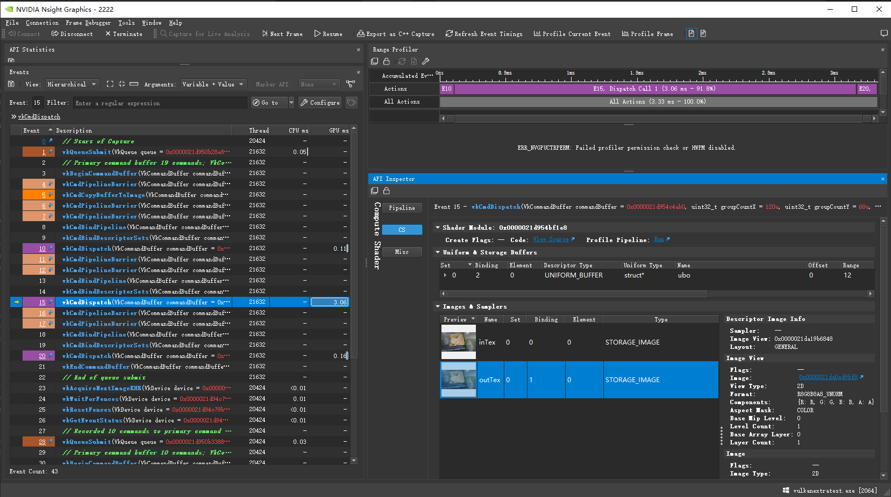

9 Dilation/Erosion.

[row morph glsl](../../glsl/source/morph1.comp)

[column morph glsl](../../glsl/source/morph2.comp)

同样使用row/column分离操作,其中3x3卷积,0.15msx2.其中10x10,0.17msx2

|核长|时间|用局部共享显存|
|---|---|---|
|3|0.15ms*2|是|
|10|0.17msx2|是|
|20|0.21msx2|是|
|3|0.14ms*2|否|
|10|0.27msx2|否|
|20|0.50msx2|否|

10 在Compute shader中插入vkCmdCopyImage发现会占用0.3ms-07ms左右的时间,从逻辑上来说,应该不可能啊,这个copy应该比最简单的运算层占去的时间要小才对,测试了二种方案,对应参数bUserPipe,表示用不用管线,用管线控制到0.2ms内,用vkCmdCopyImage在3ms以上,后面找下资料看看是什么问题

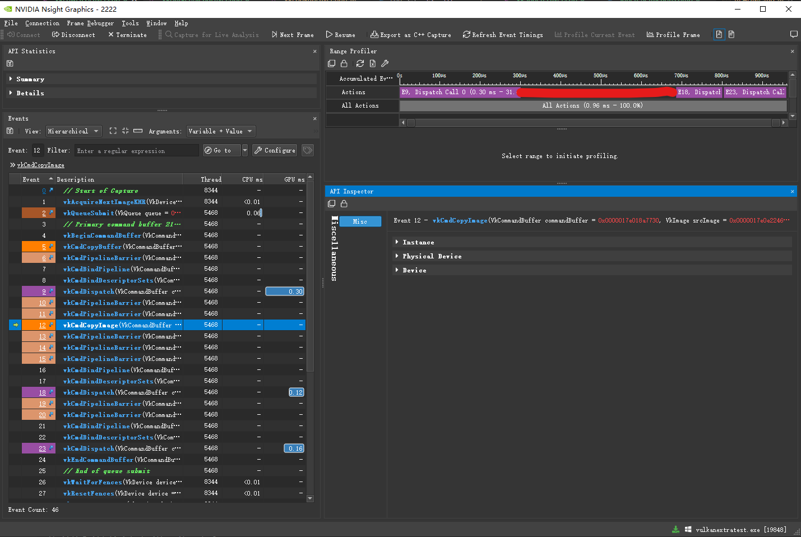
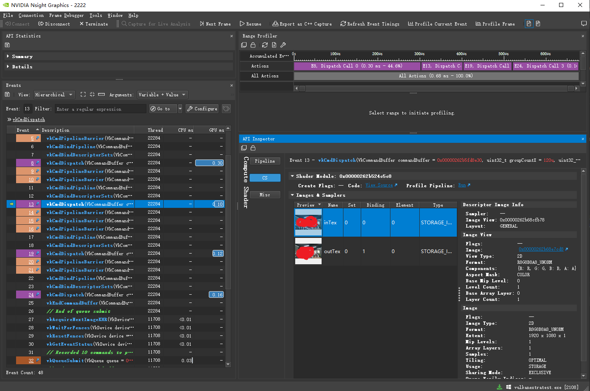

11 直方图,单通道大部分聚合算使用的是原子操作,也算是一个代表.

[glsl](../../glsl/source/histogram.comp)

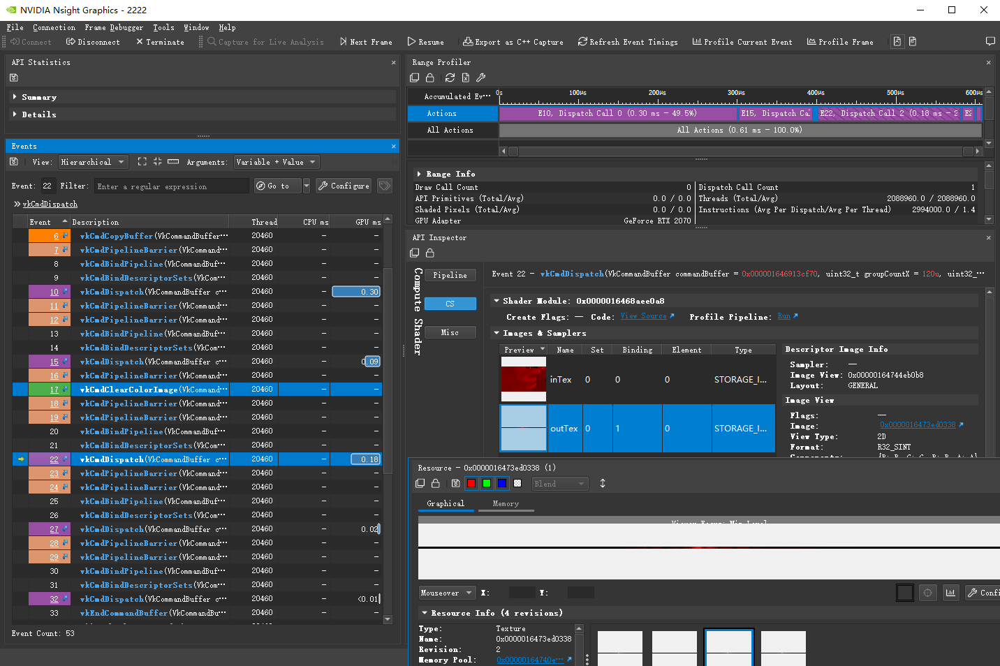

我在开始四通道时使用类似reduce2分二段,不用原子操作的方式,但是效果并不好,一是第一次把16*16块的方式转换成对应的一个个直方图,模块并没的缩小,导致第二块把这一个直方图通过for加在一起需要循环1920/16x1080/16(假设是1080P的图),这个会花费超过2ms,这种方式就pass掉,我直接使用原子操作导出四个图然后再结合都比这个快.

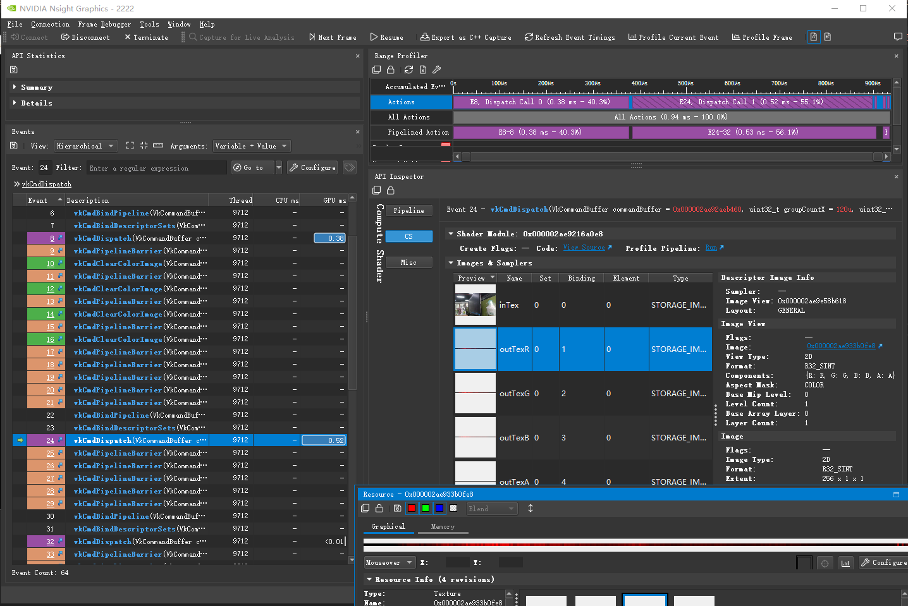

可以看到,在这之前,我们要先vkCmdClearColorImage,几乎不消费时间,我也是这样理解的,但是为什么vkCmdCopyImage会导致那么大的时间了?

时间差不多在0.2ms左右,不过随机的亮度图,亮度比较分散,后面使用只有0,1的二种图看看会不会影响这个时间.

12 Kuwahara 因其算法特点,卷积分离没有使用,只使用了局部共享内部优化.

[glsl](../../glsl/source/kuwahara.comp)

5*5的核,3.3ms,很有点高了.

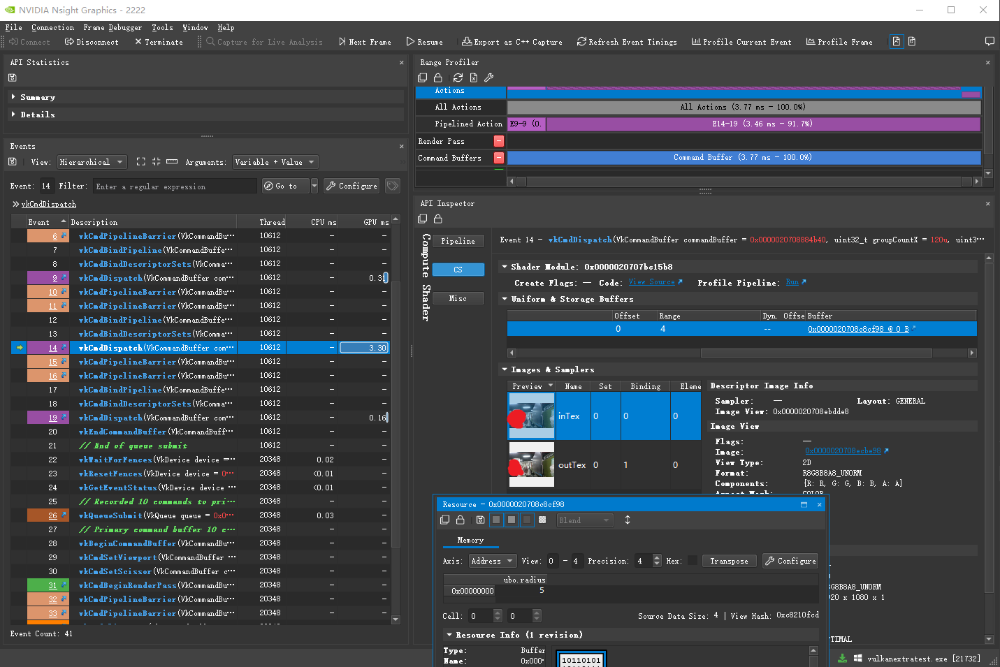

10*10的核,9.7ms.

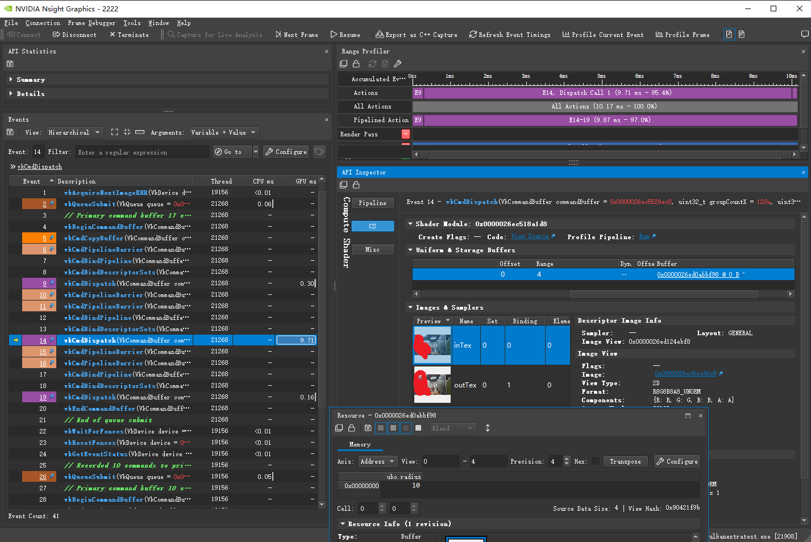

在手机Redmi 10X Pro 在720P下非常流畅,可以实时运行.

13 Median 中值滤波,算法和kuwahara类似,但是中间需要排序,所以导致时间很高

[glsl](../../glsl/source/median.comp)

10*10的核,4通道,76ms.

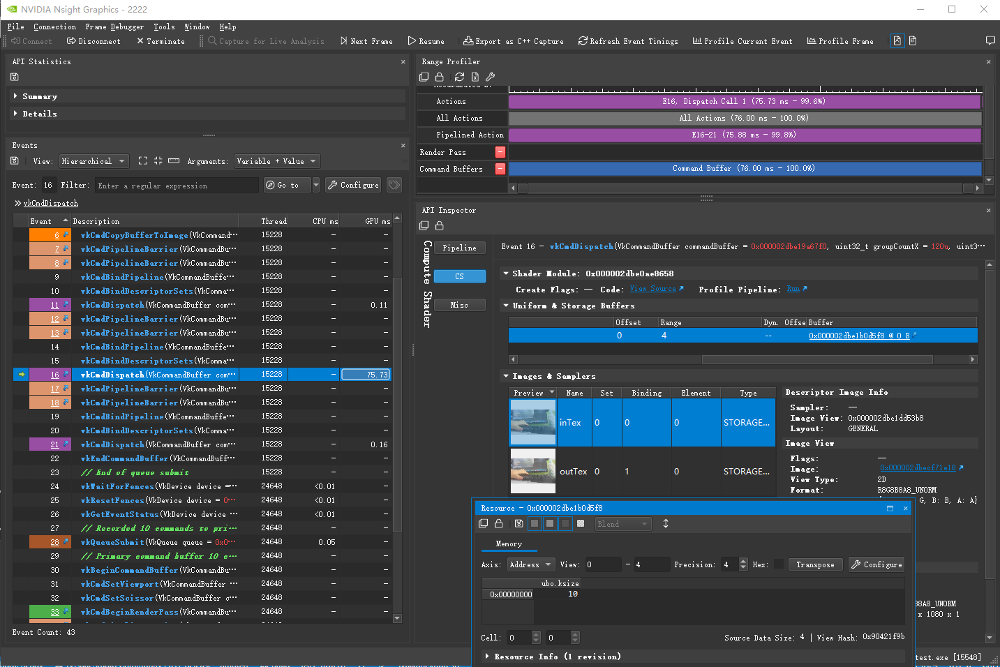

5*5的核,4通道,27ms.

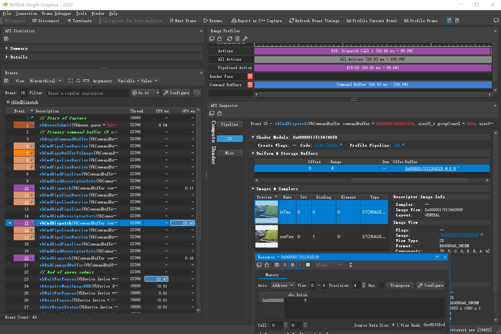

10*10的核,1通道,28ms,奇怪了,为什么1通道与4通道相差这么多?我写法有问题?

5*5的核,1通道,12ms.

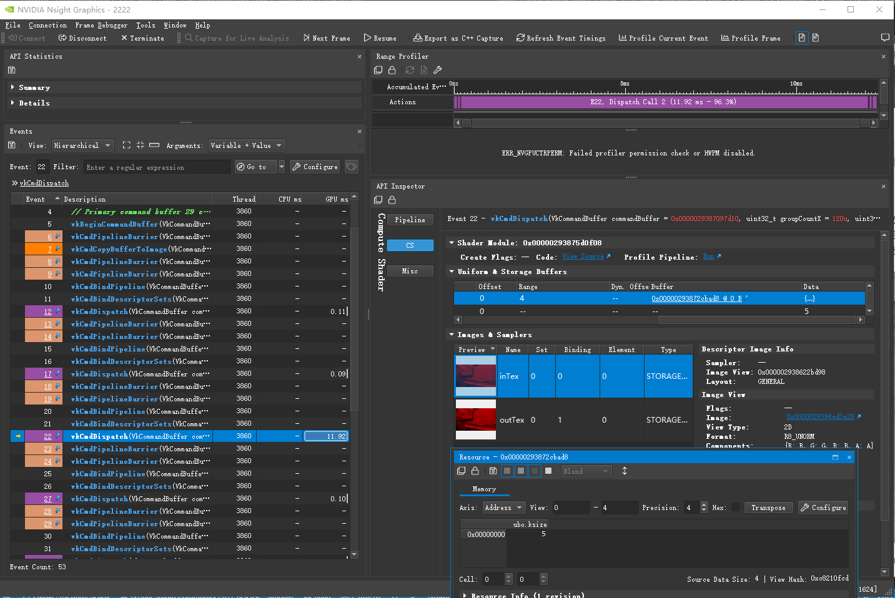

3*3的核,GPUImage里的方式,4通道,0.3ms.

总结,优化了个寂寞,虽然核大会导致排序也是指数增长,但是这次优化明显不成功,只能说是暂时可用大于3核的情况,后续找找更多的资料试试改进.

看了下相关opencv cuda里的median里的写法,在前面会声明一个图像元素*256的buffer?嗯,这个buffer是为了替换里面单个线程uint hist[256]?在CS里,一个线程声明大堆栈数据会导致性能问题吗?先暂停,opencv cuda这个算法写的太麻烦了,后面有时间研究.

## 分析

针对高斯模糊,取周边5*5=25个点,其中高斯模糊使用卷积核分离优化,列和长分别占用0.20ms左右.

其中,普通3*3,也就是NonMaximumSuppression非极大值抑制,也只需要0.19ms左右.

高斯模糊使用卷积核分离优化,时间复杂度应该是核长k,统计如上所有高斯模糊时间.

|核长|时间|类型|
|---|---|---|
|5|0.4ms|r8|
|21|1.2ms|r8|
|21|1.21ms|rgba8|
|5|0.68ms|rgbaf32|
|9|0.9ms|rgbaf32|
|11|1.0ms|rgbaf32|
|21|1.6ms|rgbaf32|

可以看到,主要和类型与核长有关,从基准5开始,大约每加一核长,增加0.05ms时间.r8/rgba8可以看到几乎没有差别,而使用rgba32f,基准时间增加0.3ms左右.
