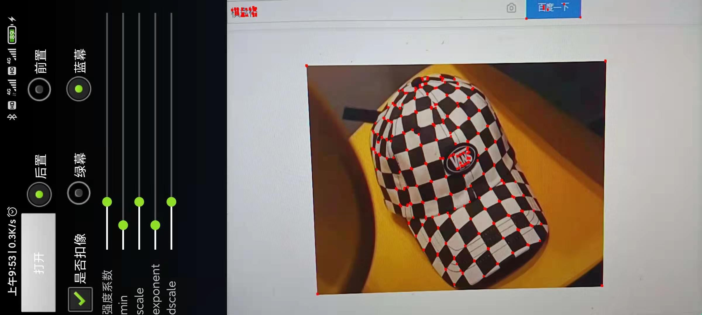
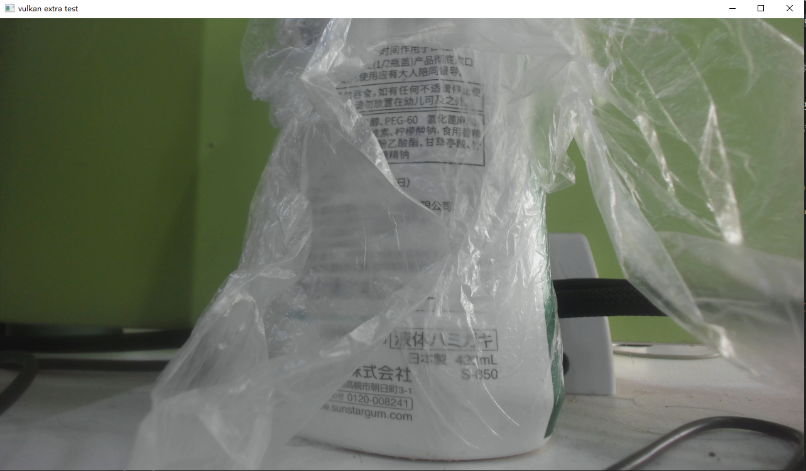
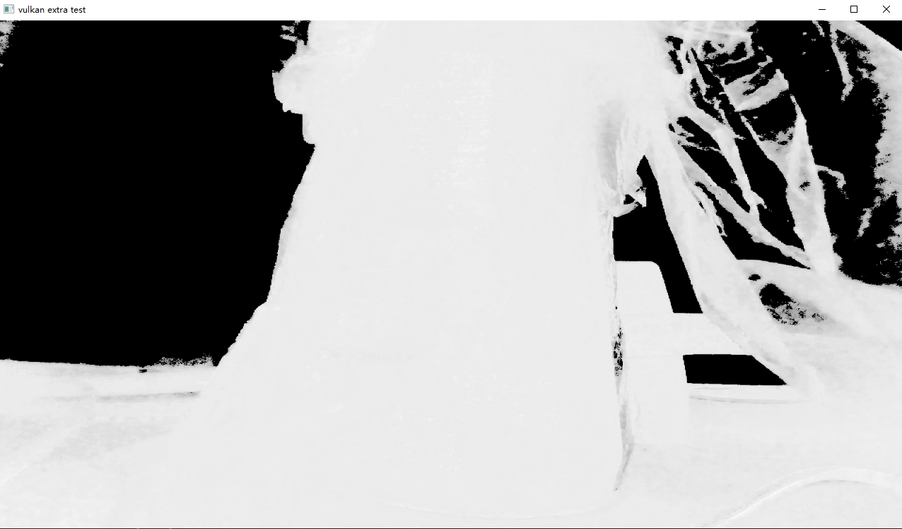
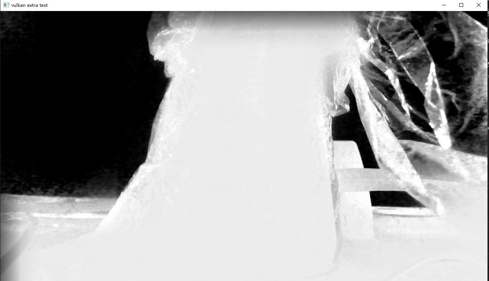
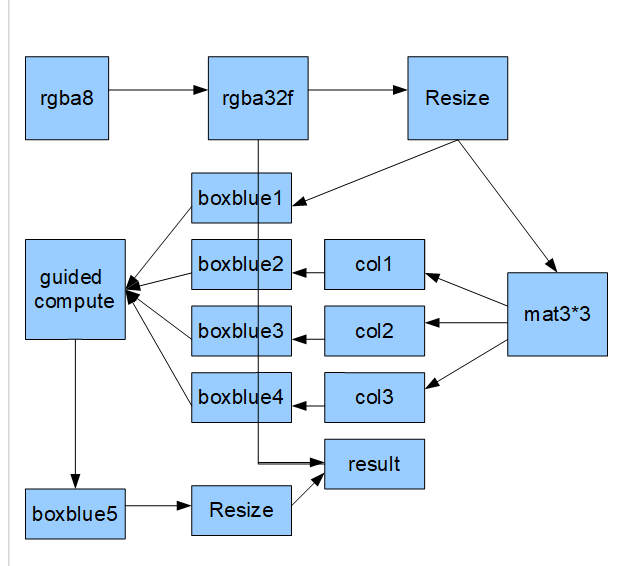
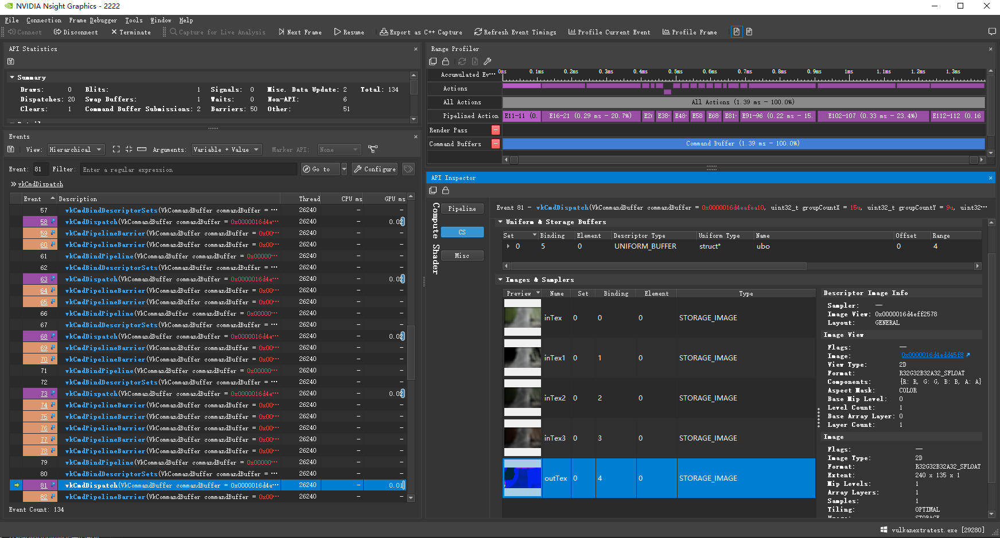

# Vulkan移植GPUImage(二)Harris角点检测与导向滤波

## Harris角点检测



UI还是用的上次扣像的,只有前后置可以用,别的没有效果,只看实现就好.

[相应源码](https://github.com/xxxzhou/aoce/blob/master/code/aoce_vulkan_extra/layer/VkHarrisCornerDetectionLayer.cpp)

在实现之前,我先重新整理编译glsl的生成工具,如Harris角点检测中间计算过程需要针对rgba32f做高斯模糊,我们前面针对rgba8实现过,现在使用glslangValidator针对一份文件生成一编译文件会导致维护麻烦,很多无意义的重复代码,暂时还不想把glslangValidator集成到代码中动态生成,所以在这,先搞定glsl根据编译条件生成多份文件的工具.

其所有glsl代码全统一移到根目录glsl/source下,编写一个py文件,在vscode里用python脚本编写工具确实很方便,写好了可以在vscode里直接运行py脚本,其中针对多条件编译定义如下文件.

```text
blend.comp
chromaKey.comp
filterColumn.comp filterColumn.comp CHANNEL_RGBA=1
filterColumn.comp filterColumnC1.comp CHANNEL_R8=1
filterColumn.comp filterColumnF4.comp CHANNEL_RGBA32F=1
filterRow.comp filterRow.comp CHANNEL_RGBA=1
filterRow.comp filterRowC1.comp CHANNEL_R8=1
filterRow.comp filterRowF4.comp CHANNEL_RGBA32F=1
```

glsl代码修改如下

```glsl
#if CHANNEL_RGBA
layout (binding = 0, rgba8) uniform readonly image2D inTex;
layout (binding = 1, rgba8) uniform image2D outTex;
#elif CHANNEL_R8
layout (binding = 0, r8) uniform readonly image2D inTex;
layout (binding = 1, r8) uniform image2D outTex;
#elif CHANNEL_RGBA32F
layout (binding = 0, rgba32f) uniform readonly image2D inTex;
layout (binding = 1, rgba32f) uniform image2D outTex;
#endif

// 共享块,扩充前后二边HALO_SIZE(分为上HALO_SIZE,中间自身*PATCH_PER_BLOCK,下HALO_SIZE)
#if CHANNEL_RGBA32F
shared vec4 column_shared[16*(PATCH_PER_BLOCK+HALO_SIZE*2)][16];//vec4[local_size_y][local_size_x]
#define packUnorm4x8
#define unpackUnorm4x8
#else
shared uint column_shared[16*(PATCH_PER_BLOCK+HALO_SIZE*2)][16];//vec4[local_size_y][local_size_x]
#endif
```

[python脚本](https://github.com/xxxzhou/aoce/blob/master/glsl/compileglsl.py)流程,针对传入的文件分析每行需要编译的文件,确认是否需要条件编译,根据条件编译每个文件,错误的话提示错误文件,正确则把所有文件复制到运行目录,安装目录.其中android则使用build.gradle复制生成目录下的编译文件到assets目录下.

相关harris检测原理可以参考:[harris边角(兴趣点)检测算法](https://zhuanlan.zhihu.com/p/42490675)

移植Harris角点检测的代码,实现比较简单,根据GPUImage源码,按XYDerivative/ GaussianBlur/ HarrisCornerDetection/ ThresholdedNonMaximumSuppression四层连接起来就行了,根据GPUImage的代码移植到Compute shader还是很快的,有兴趣可以查看[VkHarrisCornerDetectionLayer](https://github.com/xxxzhou/aoce/blob/master/code/aoce_vulkan_extra/layer/VkHarrisCornerDetectionLayer.cpp)的实现.

把角点和原图加一起显示倒是取了巧,1080P下,角点显示一个像素还是很难看清的,于是想根据原图上的点周边是否包含角点,然后显示成红色,发现这么简单一个问题,我想不到适合GPU来算的方法,取个巧,把检测的角点图模糊一下,1.0周边根据模糊半径都大于0了,然后直接比对大于0的就显示.

## 导向滤波

嗯,我发现GPUImage好像没这实现,不过这个算法效果不错,如下效果图.

原图:



绿色扣图:



扣图经过导向滤波处理:



我原来移植到CUDA过里,有兴趣移步[CUDA加opencv复现导向滤波算法](https://www.cnblogs.com/zhouxin/p/10203954.html).

我总结下了GPU里比较容易实现的流程.



看了这图,我忽然理解GPUImage为什么不实现这个算法了,算法不复杂,需要节点多输入多输出以及流程正确顺序保证,先看下类的主要流程实现,有兴趣可以查看[详细代码](https://github.com/xxxzhou/aoce/blob/master/code/aoce_vulkan_extra/layer/VkGuidedLayer.cpp).

```c++
void VkGuidedLayer::onInitGraph() {
    VkLayer::onInitGraph();
    // 输入输出
    inFormats[0].imageType = ImageType::rgba32f;
    inFormats[1].imageType = ImageType::rgba32f;
    outFormats[0].imageType = ImageType::rgba8;
    pipeGraph->addNode(convertLayer.get())
        ->addNode(resizeLayer->getLayer())
        ->addNode(toMatLayer.get());
    pipeGraph->addNode(box1Layer->getLayer());
    pipeGraph->addNode(box2Layer->getLayer());
    pipeGraph->addNode(box3Layer->getLayer());
    pipeGraph->addNode(box4Layer->getLayer());
    pipeGraph->addNode(guidedSlayerLayer->getLayer());
    pipeGraph->addNode(box5Layer->getLayer());
    pipeGraph->addNode(resize1Layer->getLayer());
}

void VkGuidedLayer::onInitNode() {
    resizeLayer->addLine(box1Layer, 0, 0);
    toMatLayer->addLine(box2Layer, 0, 0);
    toMatLayer->addLine(box3Layer, 1, 0);
    toMatLayer->addLine(box4Layer, 2, 0);
    box1Layer->addLine(guidedSlayerLayer, 0, 0);
    box2Layer->addLine(guidedSlayerLayer, 0, 1);
    box3Layer->addLine(guidedSlayerLayer, 0, 2);
    box4Layer->addLine(guidedSlayerLayer, 0, 3);
    guidedSlayerLayer->addLine(box5Layer);
    box5Layer->addLine(resize1Layer);
    convertLayer->addLine(this, 0, 0);
    resize1Layer->addLine(this, 0, 1);
    setStartNode(convertLayer);
}
```

如何保证层的执行顺序,可以查看[PipeGraph](https://github.com/xxxzhou/aoce/blob/master/code/aoce/layer/PipeGraph.cpp)的resetGraph的实现,简单来说,pipegraph添加节点的顺序不重要,重要的是addLine接入接出正确,PipeGraph会自动根据节点连接线来重构执行顺序.

可以看到虽然有很多计算层,但是效率非常高,N卡2070下,1080P的图像,快速导向resize长宽/8下,所有boxblur使用20核长,关于导向滤波的处理差不多就1ms,主要是导向滤波与图像的分辨率无关,中间所有计算可以在很少的分辨率下进行.



可以看到中间很多层大多全是0.02ms,主要就是因为导向滤波的分辨率无关性.

在安卓机器Redmi 10X Pro下测试,720P能流畅跑此效果.
