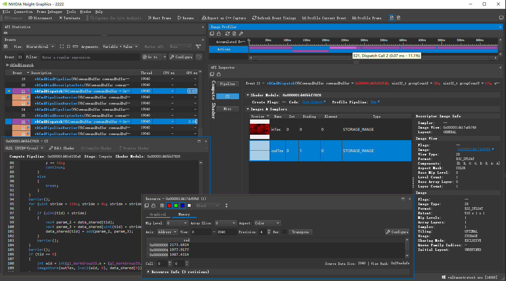

# Vulkan移植GPUImage(三)从A到C的滤镜

前面移植了几个比较复杂的效果后,算是确认了复杂滤镜不会对框架造成比较大的改动,开始从头移植,现已把A到C的所有滤镜用vulkan的ComputeShader实现了,讲一些其中实现的过程.

## AverageLuminanceThreshold 像素亮度平均阈值比较

从名字来看,就是算整图的平均高度,然后比较这个亮度值.

GPUImage的实现,先平均缩少3*3倍,然后读到CPU中计算平均亮度,然后再给下一层计算.

这步回读会浪费大量时间,我之前在CUDA测试过,1080P的回读大约在2ms左右,就算少了9倍数据量,也可能需要0.2ms,再加上回读CPU需要同步vulkan的cmd执行线程,早早提交执行command,中断流程所导致的同步时间根据运行层的复杂度可能会比上面更长.

因此在这里,不考虑GPUImage的这种实现方式,全GPU流程处理,使用Reduce方式算图像的聚合数据(min/max/sum)等,然后保存结果到1x1的纹理中,现在实现效果在2070下1080P下需要0.08ms,比一般的普通计算层更短.

主要实现类似opencv cuda里的reduce相关实现,但是他在最后使用原子操作所有局部共享显存的值,而在glsl中,原子操作限定太多,因此我分二步来操作.

第一步中,每个点取4x4个值,这步在我想象中,应该就需要0.2ms左右,根据opencv cuda相关的reduce的计算方法,使用周边PATCH_SIZE_XxPATCH_SIZE_Y个线程组的线程,互相混合取PATCH_SIZE_XxPATCH_SIZE_Y个值,其中每一个线程会赋值给周边PATCH_SIZE线程边上地址,编号x0/y0就给每个PATCH_SIZE所有线程第x号块赋值,这里代码看着是有些奇怪,如果让我来实现,我肯定就取线程周边PATCH_SIZE_XxPATCH_SIZE_Y来进行操作,对于GPU来说,应该没区别才是,在单个线程中PATCH_SIZE_XxPATCH_SIZE_Y个数据都是串行操作啊.

在第一步上面操作后,把sizeX(1920)/sizeX(1080)变成只有(480*270)个线程,其中每个线程组有16x16个,也就一共有510块线程组,每块线程组使用并行2次分操作,其中16x16=2^8,8次后就能得到所有聚合数据.

在opencv中,就是针对其中的510个线程进行原子操作,我看了下,glsl里的原子操作只能针对类型int/uint,局限太大,因此我应用了我以前[CUDA版Grabcut的实现](https://zhuanlan.zhihu.com/p/59283449)中的kmeans优化方式,把上面计算后的510个线程组中的数据放入510*1的临时texture.

注意在GPGPU运算层中,不要针对BUFFER又读又写,以前写CUDA相关算法时,尝试过几次,不管你怎么调用同步API,结果全不对,在第一步中最后把结果写入临时BUFFER,就需要在第二步,读取这个临时BUFFER.

然后开始第二步,读取这个临时BUFFER,因为要聚合所有数据,所以我们线程组就只分一个256个线程的组,在这个组里,使用for步长线程组大小来访问这个临时BUFFER的所有数据,然后聚合二分,最后把结果给到一个1x1的纹理中,如下截取第一部分的代码出来,有兴趣可以自己根据链接查看全部代码.

``` glsl
#version 450

layout (local_size_x = 16, local_size_y = 16) in;// gl_WorkGroupSize

#if CHANNEL_RGBA
layout (binding = 0, rgba8) uniform readonly image2D inTex;
#elif CHANNEL_R8
layout (binding = 0, r8) uniform readonly image2D inTex;
#elif CHANNEL_RGBA32F
layout (binding = 0, rgba32f) uniform readonly image2D inTex;
#elif CHANNEL_R32F
layout (binding = 0, r32f) uniform image2D inTex;
#endif

#if CHANNEL_RGBA || CHANNEL_RGBA32F
layout (binding = 1, rgba32f) uniform image2D outTex;
#elif CHANNEL_R8 || CHANNEL_R32F
layout (binding = 1, r32f) uniform image2D outTex;
#endif

shared vec4 data_shared[256];

// 一个线程处理每行PATCH_SIZE_X个元素
const int PATCH_SIZE_X = 4;
// 一个线程处理每列PATCH_SIZE_Y个元素
const int PATCH_SIZE_Y = 4;
// 每个线程组处理元素个数为:block size(16*4)*(16*4)

// min/max/sum 等
#if REDUCE_MIN
    #define OPERATE min
    #define ATOMIC_OPERATE atomicMin
    #define INIT_VEC4 vec4(1.0f)
#endif

#if REDUCE_MAX
    #define OPERATE max
    #define ATOMIC_OPERATE atomicMax
    #define INIT_VEC4 vec4(0.0f)
#endif

#if REDUCE_SUM
    #define OPERATE add
    #define ATOMIC_OPERATE atomicAdd
    #define INIT_VEC4 vec4(0.0f)
#endif

vec4 add(vec4 a,vec4 b){
    return a+b;
}

// 前面一个线程取多点的逻辑参照opencv cuda模块里的reduce思路
void main(){
    ivec2 size = imageSize(inTex);  
    ivec2 uv = ivec2(gl_GlobalInvocationID.xy);  
    if(uv.x >= size.x || uv.y >= size.y){
        return;
    }  
    // 组内线程一维索引    
    int tid = int(gl_LocalInvocationIndex);  
    data_shared[tid] = INIT_VEC4;
#if REDUCE_AVERAGE
    float avg = 1000.0/(gl_WorkGroupSize.x * gl_WorkGroupSize.y * PATCH_SIZE_Y * PATCH_SIZE_X);
#endif
    memoryBarrierShared();
    barrier();
    // 线程块对应内存块索引
    uint x0 = gl_WorkGroupID.x * (gl_WorkGroupSize.x*PATCH_SIZE_X) + gl_LocalInvocationID.x;
    uint y0 = gl_WorkGroupID.y * (gl_WorkGroupSize.y*PATCH_SIZE_Y) + gl_LocalInvocationID.y;
    // 周边PATCH_SIZE_X*PATCH_SIZE_Y个线程组的线程,互相混合取PATCH_SIZE_X*PATCH_SIZE_Y个值.
    // 每一个线程会赋值给周边PATCH_SIZE线程边上地址,编号x0/y0就给每个PATCH_SIZE所有线程第x号块赋值.
    // 相比直接取本身线程组周边PATCH_SIZE_X*PATCH_SIZE_Y地址进行比较来说,有什么区别吗?
    // 由sizex/sizey的范围缩小到数线程大小(sizex/PATCH_SIZE_X,sizey/PATCH_SIZE_Y)范围
    for (uint i = 0, y = y0; i < PATCH_SIZE_Y && y < size.y; ++i, y += gl_WorkGroupSize.y){
        for (uint j = 0, x = x0; j < PATCH_SIZE_X && x < size.x; ++j, x += gl_WorkGroupSize.x){
            vec4 rgba = imageLoad(inTex,ivec2(x,y));            
            data_shared[tid] = OPERATE(rgba,data_shared[tid]);
        }
    }
    memoryBarrierShared();
    barrier();
    // 然后线程组内二分比较,把值保存在data_shared[0]中
    for (uint stride = gl_WorkGroupSize.x*gl_WorkGroupSize.y / 2; stride > 0; stride >>= 1) {
       if (tid < stride){
            data_shared[tid] = OPERATE(data_shared[tid], data_shared[tid+stride]);                     
        }
        memoryBarrierShared();
        barrier();
    }
    memoryBarrierShared();
    barrier();
    // 原子操作所有data_shared[0]
    // if(tid == 0){
    //     ATOMIC_OPERATE()
    // }
    // 原子操作限定太多,放弃
    if(tid == 0){ 
        int wid = int(gl_WorkGroupID.x + gl_WorkGroupID.y * gl_NumWorkGroups.x);         
        imageStore(outTex, ivec2(wid,0), data_shared[0]);
    }
}
```

[pre reduce glsl代码](https://github.com/xxxzhou/aoce/tree/master/glsl/source/reduce.comp)

[reduce glsl代码](https://github.com/xxxzhou/aoce/tree/master/glsl/source/reduce2.comp)

[AverageLuminanceThreshold C++ 实现](https://github.com/xxxzhou/aoce/tree/master/code/aoce_vulkan_extra/layer/VkReduceLayer.cpp)



我在做之前根据3x3卷积需要0.2ms左右粗略估算下需要的时间应该在0.3ms左右,但是实际只有(0.07+0.01)ms,后面想了下,这其实是有个很大区别,模糊那种核是图中每个点需要取周边多少个点,一共取点是像素x核长x核长,而Reduce运算最开始一个点取多个像素,但是总值还是只有图像像素大小.

对于图像流(视频,拉流)来说,可以考虑在当前graph执行完vkQueueSubmit,然后VkReduceLayer层输出的1x1的结果,类似输出层,然后在需要用这结果的层,在下一桢之前把这个结果写入UNIFORM_BUFFER中,可能相比取纹理值更快,这样不会打断执行流程,也不需要同步,唯一问题是当前桢的参数是前面的桢的运行结果.

然后下面的AddBlend/AlphaBlend算是比较常规的图像处理,GPGPU最容易处理的类型,也就不说了.

### AmatorkaFilter(颜色查找表映射)

理解下原理就行,如GPUImage里,需要的是一张512*512像素,其中有8x8x(格子(64x64)),把8x8=64格子垂直平放堆叠,可以理解成一个每面64像素的正方体,其中每个格子的水平方是红色从0-1.0,垂直方向是绿色从0-1.0,而对于正方体的垂直方向是蓝色从0-1.0.

然后就是颜色映射,把对应的颜色r/g/b,当做如上三个轴的坐标,原图的蓝色确定是那二个格子(浮点数需要二个格子平均),红色找到对应格子的水平方向,绿色是垂直方向,查找到的颜色就是映射的颜色.

在这,如果自己linear插值代码就有点多了,要取周边八个点,性能可能还受影响,利用linear sampler2D简化下,只需要自己linear插值一次,在这我也找到以前传入采样器不正确的BUG,生成Texture的时间没有加入VK_IMAGE_USAGE_SAMPLED_BIT标记,不过大部分图像处理并不需要,所以新增二个方法用来表达是否需要sampled,以及是linear/nearest插值方式.

GPUImage中,那个texPos1什么0.125 - 1.0/512.0啥的,我一开始有点晕,后面自己推理下,其实应该是这样.

``` glsl
#version 450

layout (local_size_x = 16, local_size_y = 16) in;// gl_WorkGroupSize
layout (binding = 0, rgba8) uniform readonly image2D inTex;
// 8*8*(格子(64*64)),把8*8向上平放堆,可以理解成一个每面64像素的正方体.
// 其中每个格子的水平方是红色从0-1.0,垂直方向是绿色从0-1.0,而对于正方体的垂直方向是蓝色从0-1.0.
layout (binding = 1) uniform sampler2D inSampler;
layout (binding = 2, rgba8) uniform image2D outTex;

void main(){
    ivec2 uv = ivec2(gl_GlobalInvocationID.xy);
    ivec2 size = imageSize(inTex);
    if(uv.x >= size.x || uv.y >= size.y){
        return;
    }     
    vec4 color = imageLoad(inTex,uv);       
    // 如果b是0.175,对应b所在位置11.2,那就查找二张图(11,12)
    float b = color.b * 63.0;
    // 查找11这张图在8*8格子所在位置(1,3)
    vec2 q1 ;
    q1.y = floor(floor(b)/8.0f);
    q1.x = floor(b) - (q1.y * 8.0f);
    // 查找12这张图在8*8格子所在位置(1,4)
    vec2 q2 ;
    q2.y = floor(ceil(b)/8.0f);
    q2.x = ceil(b) - (q2.y * 8.0f); 
    // 格子UV+在每个格子中的UV,q1/q2[0,8)整数,rg[0.0,1.0]浮点位置转到[0,512)
    // 整点[0,512)转(0.0,1.0f),需要(整点位置+0.5)/512.0
    vec2 pos1 = (q1*64.0f + color.rg*63.0f + 0.5f)/512.f;
    vec2 pos2 = (q2*64.0f + color.rg*63.0f + 0.5f)/512.f;
    // 取pos1/pos2上值
    vec4 c1 = textureLod(inSampler, pos1,0.0f);  
    vec4 c2 = textureLod(inSampler, pos2,0); 
    // linear混合11,12这二张图的值
    vec4 result = mix(c1,c2,fract(b));
    imageStore(outTex,uv,result);
}
```

然后再比较看了一下,其实是一样的.

这个Lookup的实现,对应的他的Amatorka/MissEtikate/SoftElegance,本框架为了尽量少的引用第三方库,没有读取图片的类库,需要自己把Lookup表传入inputLayer,然后连接这层,后续会新增demo接入相应外部库给出相关对应如上所有层的实现.

原则上主体框架不引入第三方库,框架上的模块不引入非必要的第三方库,而demo不限制.

## BilateralFilter 双边滤波

网上很多讲解,这简单说下,为什么叫双边,一个是高斯滤波,这个滤波只考虑了周边像素距离,加一个滤波对应周边像素颜色差值,这样可以实现在边缘(颜色差值大)减少模糊效果.

实现也比较简单,拿出来说是因为暂时还没找到优化方法,怎么说了,这个卷积核因为不只和距离有关了,还有周边像素颜色差有关,所以只有计算时才能得到每个像素与众不同的卷积核,优化方法就需要特别一些,现在的情况的核大的话,如10核长的需要3ms,对应一般的处理层0.2ms来说,简直夸张了,现暂时这样实现,后续查找相应资料后经行优化.

前面有讲过优化的BoxBlur(同高斯优化)相关实现,余下B字母全是普通的常规的图像处理,就不拿来说了.

## CannyEdgeDetection Canny边缘检测

[Canny Edge Detection Canny边缘检测](https://blog.csdn.net/kathrynlala/article/details/82902254)

逻辑有点同HarrisCornerDetection,由多层构成,按上面链接来看,其中第四层Hysteresis Thresholding正确实现方法逻辑应该类似:opencv_cudaimgproc canny.cpp/canny.cu里edgesHysteresis,不过逻辑现有些复杂,后面有时间修改成这种逻辑,现暂时使用GPUImage里的这种逻辑.

其中GPUImageDirectionalSobelEdgeDetectionFilter/GPUImageDirectionalNonMaximumSuppressionFilter是GPUImageCannyEdgeDetectionFilter里的二个子运算组件,其GPUImageDirectionalSobelEdgeDetectionFilter先把梯度,normalize后的ddx,ddy传入GPUImageDirectionalNonMaximumSuppressionFilter.

在本项目中,上面二层分别对应VkCannyEdgeDetectionLayer里的VkSobelEdgeDetectionlayer/VkDirectionalNMS,VkSobelEdgeDetectionLayer里计算梯度,ddx,ddy,其在VkDirectionalNMS里normalize对应ddx/ddy.

其第四层GPUImageWeakPixelInclusionFilter对应VkCannyEdgeDetectionLayer里的canny.comp里的实现.

下面的CGAColorspace是常规处理,ChromaKey前面移植过[UE4 Matting](https://www.unrealengine.com/en-US/tech-blog/setting-up-a-chroma-key-material-in-ue4)的扣像处理,这个里面还考虑到整合当前环境光的处理,暂时还没看到ChromaKeyBlend/ChromaKey有更高明的实现逻辑,就不移植了.

## Closing(膨胀(Dilation)和腐蚀(Erosion))

膨胀用于扩张放大图像中的明亮白色区域,侵蚀恰恰相反,而Closing操作就是先膨胀后侵蚀.

参考 [CUDA-dilation-and-erosion-filters](https://github.com/mompes/CUDA-dilation-and-erosion-filters)

很有意思的是,这个项目有个优化比较统计,抄录如下.

I have performed some tests on a Nvidia GTX 760.

With an image of 1280x1024 and a radio ranging from 2 to 15:

| Radio / Implementation | Speed-up | CPU | Naïve | Separable | Shared mem. | Radio templatized | Filter op. templatized |
| ---------------------- | -------- | --- | ----- | --------- | ----------- | ----------------- | ---------------------- |
| 2 | 34x | 0.07057s | 0.00263s | 0.00213s | 0.00209s | 0.00207s | 0.00207s |
| 3 | 42x | 0.08821s | 0.00357s | 0.00229s | 0.00213s | 0.00211s | 0.00210s |
| 4 | 48x | 0.10283s | 0.00465s | 0.00240s | 0.00213s | 0.00221s | 0.00213s |
| 5 | 56x | 0.12405s | 0.00604s | 0.00258s | 0.00219s | 0.00219s | 0.00221s |
| 10 | 85x | 0.20183s | 0.01663s | 0.00335s | 0.00234s | 0.00237s | 0.00237s |
| 15 | 95x | 0.26114s | 0.03373s | 0.00433s | 0.00287s | 0.00273s | 0.00274s |

其中cpu的逻辑同cuda Separable逻辑一样,都做了行列分离的优化.

这个GPU代码也有点意思,我在初看Shared mem部分代码时还以为逻辑有问题了,都没有填充完需要的shared部分,看了grid/block的分配才发现,原来这样也行,记录下这个思路,grid还是正常分配,但是block根据核长变大,这样线程组多少没变,但是线程组的大小变大,总的线程变多.根据threadIdx确定线程组内索引,然后根据blockId与传入实际线程组大小确定正确的输入BUFFER索引,注意,直接使用全局的id是对应不上相应的输入BUFFER索引.

我在这还是使用前面的[GaussianBlur row](https://github.com/xxxzhou/aoce/tree/master/glsl/source/filterRow.comp)里的优化,但是相关过程有些复杂,我简化了下,没有PATCH_PER_BLOCK的概念,在固定16x16的线程组里,一个线程取三个点,如[Morph row](https://github.com/xxxzhou/aoce/tree/master/glsl/source/morph1.comp)块中,分别是左16x16,自身16x16,右16x16块,也没什么判断,核长在32以内都能满足,代码抄录第一部分如下.

``` glsl
#version 450

// #define IS_SHARED 1

layout (local_size_x = 16, local_size_y = 16) in;// gl_WorkGroupSize
layout (binding = 0, r8) uniform readonly image2D inTex;
layout (binding = 1, r8) uniform image2D outTex;

layout (binding = 2) uniform UBO {
	int ksize;	    
} ubo;

#if EROSION 
    #define OPERATE min
    #define INIT_VUL 1.0f
#endif

#if DILATION 
    #define OPERATE max
    #define INIT_VUL 0.0f
#endif

#if IS_SHARED
// 限定最大核为32
shared float row_shared[16][16*3];
void main(){
    ivec2 uv = ivec2(gl_GlobalInvocationID.xy);
    ivec2 size = imageSize(inTex);
    if(uv.x >= size.x || uv.y >= size.y){
        return;
    } 
    ivec2 locId = ivec2(gl_LocalInvocationID.xy);
    for(int i = 0; i < 3; i++){
        uint gIdx = max(0,min(uv.x+(i-1)*16,size.x-1));
        row_shared[locId.y][locId.x + i*16] = imageLoad(inTex,ivec2(gIdx,uv.y)).r;      
    }
    memoryBarrierShared();
	barrier();
    float result = INIT_VUL;
    for(int i =0; i < ubo.ksize; i++){
        int ix = locId.x - ubo.ksize/2 + i;
        float fr = row_shared[locId.y][16 + ix];
        result = OPERATE(fr,result);
    }
    imageStore(outTex, uv, vec4(result)); 
}

#else

void main(){
    ivec2 uv = ivec2(gl_GlobalInvocationID.xy);
    ivec2 size = imageSize(inTex);
    if(uv.x >= size.x || uv.y >= size.y){
        return;
    } 
    float result = INIT_VUL;
    for(int i = 0; i< ubo.ksize; ++i){
        int x = uv.x-ubo.ksize/2+i;
        x = max(0,min(x,size.x-1));
        float r = imageLoad(inTex,ivec2(x,uv.y)).r;
        result = OPERATE(result,r);
    }
    imageStore(outTex, uv, vec4(result));     
}

#endif

```

有二个版本,分别是使用共享局部显存和不使用共享局部显存的,也比较下时间.

|核长|时间|局部共享显存|
|---|---|---|
|3|0.15ms*2|是|
|10|0.17msx2|是|
|20|0.21msx2|是|
|3|0.14ms*2|否|
|10|0.27msx2|否|
|20|0.50msx2|否|

对比使用/不使用共享局部显存,在核不大的情况下,没什么区别,大核优势开始增加.

其在大核的情况下,表现比原来的GaussianBlur里效果更好,性能比对可以看[PC平台Vulkan运算层时间记录](https://github.com/xxxzhou/aoce/tree/master/doc/PC平台Vulkan运算层时间记录.md)里的结果,其在20核长,原GaussianBlur要比Morph多2到3倍时间,不过[GaussianBlur row](https://github.com/xxxzhou/aoce/tree/master/glsl/source/filterRow.comp)这种写法扩展性会更好,对线程组大小也没要求.

然后是一大堆常规C开头字母的滤镜处理,其大部分在[VkBlendingModeLayer](../../code/aoce_vulkan_extra/layer/VkBlendingModeLayer.cpp),因逻辑简单类似,就偷懒放这一个文件里处理,略过说明.

## LBP(Local Binary Patterns)特征检测

刚看GPUImage代码实现有点奇怪,看了[OpenCV——LBP(Local Binary Patterns)特征检测](https://www.cnblogs.com/long5683/p/9738095.html)才明白,就是用RGB每个通道8位保存周边比较的值而已.

ColorPackingFilter,我看了下是HarrisCornerDetection的一个子组件,然后被弃用了,所以不移植了.

## FAST特征检测器

初看GPUImage里的实现,以为是用了二层,后面发现根本没有用BoxBlue层,其实现也和网上说明有区别,只查找了周边八个顶点,暂时用GPUImage里的实现,后续看有时间移植opencv里的实现不.

ContrastFilter常规图像处理,略过说明.

## CropFilter

我看说明是截取一部分,实现一个类似不复杂,不过定义的参数可能有区别,我是定义中心的UV,以及截取长宽四个参数,其中特别加了个处理,如果长宽为0,只取一个点保存到1x1的纹理中,我是想到后续实现如我在图像上取一点,然后用于下一层图像去处理,比如扣像中,我取图像中一点用于ChromaKeyColor用于扣像层.

CrosshairGenerator这个我看了下GPUImage实现,发现尽然有用到顶点着色器的逻辑操作,我在网上也没找到这个类的实现效果是啥,暂时就先不移植了,后续看到实现效果再补上.

CrosshatchFilter常规图像处理,略过说明.

## 结尾说明

差不多到这里,从A到C的所有层都用vulkan的ComputeShader实现完毕,加上前面移植的几个层,感觉移植所有滤镜的进度应该在20%左右了,不过我准备先移植所有层,然后再测试所有层,所以现在一些层可能逻辑并不正确,后续会给每层加上测试.

上面一直提到一些层的花费时间,全在[PC平台Vulkan运算层时间记录](https://github.com/xxxzhou/aoce/tree/master/doc/PC平台Vulkan运算层时间记录.md)里,这个用于计录一些层的效率,也用来后续优化方向,因为会一直更新,再加上对应记录图片全在github上,所以先只发github上的链接,大家有兴趣可以看看.
